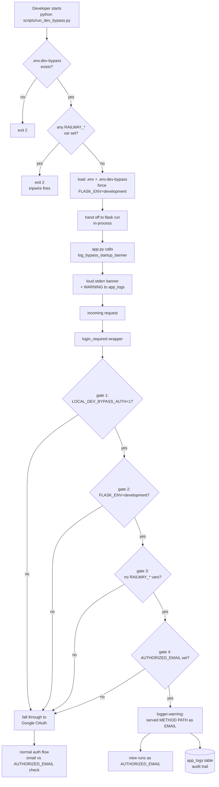

```mermaid
flowchart LR
    A[Browser /scan page<br/>Parse as: Tasks / Goals] -->|image + parse_as| B[scan_api.upload]
    B --> C[Google Vision OCR<br/>server-side]
    C --> D{parse_as?}
    D -->|tasks| E[scan_service.parse_tasks_from_text<br/>Claude API]
    D -->|goals| F[scan_service.parse_goals_from_text<br/>Claude API]
    E --> G[Task candidates JSON]
    F --> H[Goal candidates JSON<br/>title/category/priority/target_quarter]
    G --> I[Browser review UI]
    H --> I
    I -->|confirm + kind| J[scan_api.confirm]
    J --> K{kind?}
    K -->|tasks| L[create_tasks_from_candidates]
    K -->|goals| M[create_goals_from_candidates]
    L --> N[(Task rows<br/>Inbox tier)]
    M --> O[(Goal rows<br/>enum fallbacks)]
    N --> P[ImportLog<br/>source=scan_YYYY_MM_DD_HHMMSS<br/>shared batch_id]
    O --> P
```

# Architecture

Living architecture document. Claude Code must update this file whenever a new
component is added, a data flow changes, or a security boundary shifts.

---

## Diagram

```
                        ┌──────────────────────────────┐
                        │       User Devices           │
                        │  iPhone · Mac · Windows PC   │
                        └──────────────┬───────────────┘
                                       │ HTTPS (Talisman)
                                       │ Google OAuth 2.0
                                       ▼
        ┌──────────────────────────────────────────────────────────┐
        │                      Railway                             │
        │  ┌────────────────────────────────────────────────────┐  │
        │  │                 Flask App                          │  │
        │  │  Routes: auth · tasks · goals · digest ·           │  │
        │  │          scan · import · settings                  │  │
        │  │  Services: task · goal · digest · scan             │  │
        │  │  Crypto: Fernet (encrypt sensitive fields)         │  │
        │  └────────┬─────────────────┬────────────────┬────────┘  │
        │           │                 │                │           │
        │           ▼                 ▼                ▼           │
        │   ┌───────────────┐  ┌────────────┐  ┌──────────────┐   │
        │   │  PostgreSQL   │  │ APScheduler│  │  In-memory   │   │
        │   │ tasks (url,   │  │ daily      │  │  image buffer│   │
        │   │  parent_id)·  │  │ digest @   │  │ (never       │   │
        │   │ goals·projects│  │ DIGEST_TIME│  │  persisted)  │   │
        │   │ recurring·    │  │            │  │              │   │
        │   │ import_log·   │  │            │  │              │   │
        │   │ app_logs      │  │            │  │              │   │
        │   └───────────────┘  └─────┬──────┘  └──────┬───────┘   │
        └──────────────────────────┬─┴─────────────────┬──────────┘
                                   │                   │
                           SendGrid│           Google  │  Anthropic
                                   ▼           Vision  ▼  Claude API
                           ┌───────────────┐    ┌──────────────────┐
                           │ Work Outlook  │    │  OCR + task      │
                           │ (air-gapped,  │    │  parsing (server │
                           │  one-way in)  │    │  side only)      │
                           └───────────────┘    └──────────────────┘

        GitHub (shigsdev/taskmanager) ──push to main──► Railway auto-deploy
```

---

## Components

- **User devices** — iPhone, Mac laptop, Windows PC. All access the app via
  browser over HTTPS.
- **Flask app** — the single web service. Hosts routes, auth, services, and
  scheduler. One process, gunicorn-served.
- **PostgreSQL** — Railway-managed. Stores tasks (with optional `url` and
  self-referential `parent_id` for one-level subtasks), projects, goals,
  recurring tasks, import log, and app_logs.
- **APScheduler** — in-process scheduler that fires the daily digest at
  `DIGEST_TIME` in the user's configured timezone.
- **Fernet crypto module** — symmetric encryption for sensitive fields
  (work email, API keys if ever stored in DB).
- **Google OAuth 2.0** — only login path. Validates the authenticated email
  against `AUTHORIZED_EMAIL` before any data is served.
- **SendGrid** — outbound daily digest email to work Outlook.
- **Google Vision API** — OCR for the image scan feature. Server-side only.
- **Anthropic Claude API** — parses OCR text into discrete task or goal
  candidates. Server-side only.
- **Work Outlook** — receives the daily digest. Air-gapped from the app;
  digest is the only bridge.
- **GitHub repo** (`shigsdev/taskmanager`) — source of truth. Push to main
  triggers Railway auto-deploy.
- **reMarkable** — manual capture only in Phase 1, no API integration.

---

## Data Flows

- **User → App**: HTTPS request, Google OAuth session cookie (encrypted,
  24h inactivity expiry).
- **App → DB**: SQLAlchemy ORM queries. No raw SQL.
- **App → SendGrid**: once per day at `DIGEST_TIME`, plain-text email with
  Today / Overdue / Goals summary / This Week count.
- **Image scan**: browser uploads image + a `parse_as` discriminator
  (`tasks` or `goals`) → Flask holds the image in memory → Google Vision
  (server-side) → Claude API (server-side) parses into either task or
  goal candidates depending on the discriminator → candidates returned
  to the browser for review → user confirms → records written to DB
  sharing a single `batch_id` UUID (so the whole scan is one undo unit
  in the recycle bin) with an `import_log` row tagged
  `scan_YYYY_MM_DD_HHMMSS` → image discarded. Tasks land in the Inbox
  tier; goals land with sensible enum fallbacks
  (`PERSONAL_GROWTH` / `NEED_MORE_INFO`) that the user can edit before
  confirming. See "Scan pipeline" diagram below.
- **URL save**: user pastes or types a URL in the quick-capture bar → the
  browser `POST`s to `/api/tasks/url-preview` → Flask resolves the hostname,
  validates it is not a private/loopback IP (SSRF protection), fetches the
  page, and extracts the `<title>` → title returned to the browser as the
  suggested task title → user confirms → task created with `url` field.
- **Subtasks**: tasks have an optional `parent_id` self-referential FK.
  Subtasks are full tasks (own tier, due date, status) limited to one level
  deep (a subtask cannot itself have subtasks). Parent cards show a badge
  with active/done counts. Completing a parent warns about open subtasks.
  Subtasks inherit `goal_id` and `project_id` from their parent unless
  explicitly overridden. Updating a parent's goal/project cascades to
  subtasks that still match the old value.
- **Import**: user pastes OneNote text or uploads Excel goals file → parser
  produces preview → user confirms → records written to DB, entry written
  to `import_log`.
- **GitHub → Railway**: push to `main` triggers rebuild + deploy via Nixpacks;
  `release` phase runs `flask db upgrade`.

---

## JavaScript Testing

Pure client-side logic is extracted into importable modules so Jest can
test them in Node without a browser.  The canonical example is
`static/parse_capture.js` — the quick-capture parsing function, which is
loaded via `<script>` tag in the browser and via `require()` in Jest.

- **Test runner**: Jest 29 (Node environment)
- **Test location**: `tests/js/unit/` (mirrors the Python `tests/` layout)
- **Config**: `jest.config.js` at repo root
- **Run**: `npm test` (after `npm install`)
- **E2E runner**: Playwright (Chromium) — real browser API tests
- **Local E2E**: `tests/e2e/` (3 spec files, 23 tests)
  - `service-worker.spec.js` — SW lifecycle, cache, CLEAR_CACHE
  - `pages.spec.js` — page navigation, capture bar round-trip, detail panel
  - `browser-apis.spec.js` — Web Speech, client error reporter, update banner
- **Prod E2E**: `tests/e2e-prod/smoke.spec.js` — 5 smoke tests against the
  deployed Railway URL. Requires `TASKMANAGER_SESSION_COOKIE` env var.
  Catches bugs that manifest only in prod (CSP, cookie flags, HTTPS, Railway
  proxy quirks).
- **E2E config**: `playwright.config.js` — two projects (`chromium`,
  `chromium-prod`); prod project is auto-skipped if the cookie env var is
  unset.
- **Run local E2E**: `npm run test:e2e` (requires bypass server on port 5111)
- **Run prod E2E**: `npm run test:e2e:prod` (requires cookie env var set)

### Post-deploy validation pipeline

After every `git push`, `scripts/validate_deploy.py` runs a structured
validation against the live Railway URL:

1. Poll `/healthz` every 15s until `git_sha` matches the local HEAD (up to
   10 minutes). This proves Railway's rolling deploy replaced the old
   container — a plain `curl /healthz` would return 200 from the old
   container during the rollout and falsely look green.
2. Verify every check in the health report is `ok`, `warn:`, or `skipped:`.
   Any `fail:` status = DEPLOY RED.
3. **Optional `--auth-check`**: hit `/api/auth/status` with a saved session
   cookie (default `~/.taskmanager-session-cookie`). On 200 → auth pipeline
   healthy. On 401 → prints copy-pasteable cookie-refresh instructions and
   exits with code 2 (distinct from DEPLOY RED to let CI treat it as a
   human-action-needed signal rather than a pipeline failure).

The `/api/auth/status` endpoint (see `auth_api.py`) is a deliberately
narrow, public, read-only JSON endpoint that reports the caller's
authentication state. It enforces the same single-user lockdown as
`login_required` — a valid Google session for an email other than
`AUTHORIZED_EMAIL` still returns 401.

### Long-lived validator cookie (`validator_cookie.py`)

The naive "copy your browser session cookie" path for the validator has
a silent failure mode: Flask-Dance auto-refreshes the Google OAuth
token during normal browser use, which re-signs the `session` cookie
and invalidates any previously-captured copy.

The fix is a **dedicated, signed, opt-in credential** minted offline via
a Flask CLI command:

```
flask mint-validator-cookie [--days 90] [--email me@example.com]
```

Properties:

- Signed with `SECRET_KEY` using `itsdangerous.URLSafeTimedSerializer`
  with a dedicated salt (`taskmanager-validator-v1`) — distinct from
  Flask's own `cookie-session` salt, so the session signer cannot
  forge validator cookies and vice versa.
- Lives in its own cookie name (`validator_token`) independent of
  Flask's `session` cookie. Not affected by `PERMANENT_SESSION_LIFETIME`.
- Default 90-day lifetime (enforced by re-validating against the
  signed timestamp + the `days` baked into the payload).
- Carries only the authorized email — no OAuth token, no user data.
- Authenticates **only** `/api/auth/status` — other protected routes
  still require OAuth via `login_required`. A leaked validator cookie
  therefore grants access to nothing except the auth-state reporter.
- Rotating `SECRET_KEY` instantly invalidates all previously-minted
  validator cookies — the emergency revocation mechanism.

The validator script (`scripts/validate_deploy.py`) sends the stored
cookie under both names (`validator_token=X; session=X`) so a single
file works for both the preferred long-lived path and the legacy
browser-copied session path.

---

## External Dependencies (version pins maintained in `requirements.txt`)

- flask, flask-sqlalchemy, flask-migrate, flask-dance, flask-talisman,
  flask-limiter
- psycopg (v3, binary) — SQLAlchemy URL scheme `postgresql+psycopg://`
- cryptography (Fernet)
- apscheduler
- sendgrid
- google-cloud-vision
- anthropic
- gunicorn
- python-dotenv (local dev only)

---

## Security Boundaries

- **HTTPS-only**: all external traffic enforced by Flask-Talisman.
- **Auth boundary**: every data route validates authenticated email ==
  `AUTHORIZED_EMAIL` before serving anything.
- **Encryption at rest**: work email address encrypted with Fernet. Any
  future sensitive fields follow the same pattern.
- **Secrets boundary**: all keys live in Railway environment variables.
  `.env` is gitignored; nothing secret is ever committed.
- **Server-side-only APIs**: Google Vision and Anthropic Claude calls are
  made from the Flask backend. The browser never holds those keys or talks
  to those APIs directly.
- **Image handling boundary**: uploaded images live only in memory for the
  duration of one request. Never written to disk, never written to DB, no
  metadata retained.
- **SSRF boundary**: the URL preview endpoint (`/api/tasks/url-preview`)
  resolves the hostname and validates the resolved IP is not in any
  private or reserved range (127.0.0.0/8, 10.0.0.0/8, 172.16.0.0/12,
  192.168.0.0/16, 169.254.0.0/16) before making the outbound request.
- **Air-gap boundary**: the user's work VDI cannot reach the app directly.
  The daily digest email to work Outlook is the only (one-way) bridge.

---

## Scan pipeline (tasks OR goals)

The same OCR → Claude pipeline serves two destinations, picked by a
radio toggle on `/scan`. A single `batch_id` ties every record from one
scan together so the recycle bin can undo the whole scan in one click.

### Mermaid



### ASCII fallback

```
   Browser /scan                       Server (Flask)
   ┌───────────────┐    image +       ┌──────────────────┐
   │ Parse as:     │──parse_as───────▶│ scan_api.upload  │
   │  ( ) Tasks    │                  └────────┬─────────┘
   │  ( ) Goals    │                           ▼
   └───────▲───────┘              ┌──────────────────────┐
           │                      │ Google Vision OCR    │
           │                      │   (server-side)      │
           │                      └──────────┬───────────┘
           │                                 ▼
           │                        ┌────────────────┐
           │                        │  parse_as?     │
           │                        └───┬────────┬───┘
           │                       tasks│        │goals
           │                            ▼        ▼
           │                  ┌──────────┐  ┌──────────┐
           │                  │ Claude   │  │ Claude   │
           │                  │ task     │  │ goal     │
           │                  │ prompt   │  │ prompt   │
           │                  └────┬─────┘  └────┬─────┘
           │  candidates JSON      │             │
           │◀──────────────────────┴──────┬──────┘
           │                              │
           │  user confirms + kind        ▼
           └─────────────────▶ ┌──────────────────┐
                               │ scan_api.confirm │
                               └────┬────────┬────┘
                              tasks │        │ goals
                                    ▼        ▼
                         ┌──────────┐   ┌──────────┐
                         │ Task rows│   │ Goal rows│
                         │  Inbox   │   │ fallbacks│
                         └────┬─────┘   └─────┬────┘
                              └────┬──────────┘
                                   ▼
                         ┌──────────────────────┐
                         │ ImportLog            │
                         │ shared batch_id UUID │
                         │ source=scan_...      │
                         └──────────────────────┘
```

---

## Local dev auth bypass

`LOCAL_DEV_BYPASS_AUTH` is a localhost-only short-circuit that lets the
agent (or a local browser) reach protected pages without completing
real Google OAuth. It is the opposite of a security hole: it is gated
by **four independent checks**, refuses to fire if any single gate
fails, and the Railway tripwire alone verifies three different
`RAILWAY_*` variables so a rename of any one of them cannot silently
disarm it. Every bypass-served request logs a WARNING row to
`app_logs` so the audit trail matches the audit trail for real
requests. See `auth._dev_bypass_active` and `scripts/run_dev_bypass.py`.

### Mermaid



### ASCII fallback

```
 Developer                        Agent / Browser
     │                                   │
     │ $ python scripts/run_dev_bypass.py│
     ▼                                   │
 ┌──────────────────────────┐            │
 │ run_dev_bypass.py        │            │
 │  ① .env.dev-bypass file? │──no──▶ exit 2
 │  ② any RAILWAY_* set?    │──yes──▶ exit 2  (tripwire)
 │  ③ load env files        │            │
 │  ④ FLASK_ENV=development │            │
 │  ⑤ in-process flask run  │            │
 └────────────┬─────────────┘            │
              ▼                          │
 ┌──────────────────────────┐            │
 │ app.py create_app()      │            │
 │  log_bypass_startup_     │            │
 │    banner() ──▶ stderr   │            │
 │                ──▶ WARN  │──▶ app_logs
 └────────────┬─────────────┘            │
              │                          │
              ▼                          │
      ┌─────────────┐    HTTP GET /      │
      │ Flask ready │◀───────────────────┘
      └──────┬──────┘
             ▼
     ┌────────────────────────────────────┐
     │ @login_required wrapper            │
     │                                    │
     │  gate 1: LOCAL_DEV_BYPASS_AUTH=1 ? │──no──┐
     │  gate 2: FLASK_ENV=development ?   │──no──┤
     │  gate 3: no RAILWAY_* var set ?    │──no──┤
     │  gate 4: AUTHORIZED_EMAIL set ?    │──no──┤
     │                                    │      │
     │  ALL PASS  ──▶  logger.warning     │      │
     │                 "served GET /path  │──▶ app_logs
     │                  as me@…"          │
     │                                    │      │
     │  view runs as AUTHORIZED_EMAIL     │      │
     └────────────────────────────────────┘      │
                                                 ▼
                                       ┌──────────────────┐
                                       │ Real Google OAuth│
                                       │ + email == AUTH- │
                                       │   ORIZED_EMAIL   │
                                       └──────────────────┘
```

### Safety properties

- **Off by default.** The bypass only fires when `.env.dev-bypass`
  exists AND every gate passes. The file is gitignored; its existence
  is the on/off switch.
- **Cannot run on Railway.** Three independent `RAILWAY_*` variables
  are checked. A rename of any one of them cannot disarm the gate —
  Railway would have to rename all three at once. Verified
  post-deploy by querying `/api/debug/logs?level=WARNING` for bypass
  log rows (expected: zero).
- **Pre-flight refuses to start.** `scripts/run_dev_bypass.py` runs
  the same Railway check before Flask even imports, so even an ssh
  into a Railway shell cannot start the bypass.
- **Loud banner.** Every Flask boot with the bypass active prints a
  multi-line stderr banner listing tripwire status and the logged-in
  email. Impossible to leave on by accident without noticing.
- **Audit trail.** Every bypass-served request writes a WARNING row
  to `app_logs` including method, path, and email. The startup
  banner also writes a WARNING row so the start of the session is
  captured in the same table as the per-request rows.
- **Session-scoped.** The bypass lasts only until the Flask process
  stops. Deleting `.env.dev-bypass` is required before any commit;
  see README "Local browser testing with bypass mode".

---

## Baseline

This document's baseline is the initial spec (generated April 2026). Claude
Code must regenerate and update it whenever the system topology changes.
