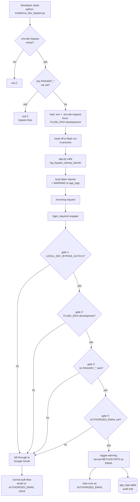

```mermaid
flowchart LR
    A[Browser /scan page<br/>Parse as: Tasks / Goals] -->|image + parse_as| B[scan_api.upload]
    B --> C[Google Vision OCR<br/>server-side]
    C --> D{parse_as?}
    D -->|tasks| E[scan_service.parse_tasks_from_text<br/>Claude API]
    D -->|goals| F[scan_service.parse_goals_from_text<br/>Claude API]
    E --> G[Task candidates JSON]
    F --> H[Goal candidates JSON<br/>title/category/priority/target_quarter]
    G --> I[Browser review UI]
    H --> I
    I -->|confirm + kind| J[scan_api.confirm]
    J --> K{kind?}
    K -->|tasks| L[create_tasks_from_candidates]
    K -->|goals| M[create_goals_from_candidates]
    L --> N[(Task rows<br/>Inbox tier)]
    M --> O[(Goal rows<br/>enum fallbacks)]
    N --> P[ImportLog<br/>source=scan_YYYY_MM_DD_HHMMSS<br/>shared batch_id]
    O --> P
```

# Architecture

Living architecture document. Claude Code must update this file whenever a new
component is added, a data flow changes, or a security boundary shifts.

---

## Diagram

```
                        ┌──────────────────────────────┐
                        │       User Devices           │
                        │  iPhone · Mac · Windows PC   │
                        └──────────────┬───────────────┘
                                       │ HTTPS (Talisman)
                                       │ Google OAuth 2.0
                                       ▼
        ┌──────────────────────────────────────────────────────────┐
        │                      Railway                             │
        │  ┌────────────────────────────────────────────────────┐  │
        │  │                 Flask App                          │  │
        │  │  Routes: auth · tasks · goals · projects · digest  │  │
        │  │          scan · import · settings · review         │  │
        │  │          + /tier/<name> · /completed · /docs       │  │
        │  │  API: /api/tasks · /api/tasks/bulk · /api/goals    │  │
        │  │       /api/projects · /api/recurring · .../spawn   │  │
        │  │       /api/recurring/previews · /api/debug/logs    │  │
        │  │  Services: task · goal · digest · scan · project   │  │
        │  │            recurring · logging · validator-cookie  │  │
        │  │  Crypto: Fernet (encrypt sensitive fields)         │  │
        │  │  Startup gate: _ensure_postgres_enum_values()      │  │
        │  │    re-applies ALTER TYPE ADD VALUE IF NOT EXISTS   │  │
        │  │    in AUTOCOMMIT for late-introduced enum members  │  │
        │  │  Engine options: pool_pre_ping=True (#31) —        │  │
        │  │    SELECT 1 on checkout; transparently reconnects  │  │
        │  │    when Railway's pooled SSL handshake goes stale  │  │
        │  │  DBLogHandler: uses isolated Session(db.engine),   │  │
        │  │    survives poisoned request transactions (saga    │  │
        │  │    a0a05a1)                                        │  │
        │  └────────┬─────────────────┬────────────────┬────────┘  │
        │           │                 │                │           │
        │           ▼                 ▼                ▼           │
        │   ┌───────────────┐  ┌────────────┐  ┌──────────────┐   │
        │   │  PostgreSQL   │  │ APScheduler│  │  In-memory   │   │
        │   │ tasks (url,   │  │ daily      │  │  image buffer│   │
        │   │  parent_id,   │  │ digest @   │  │ (never       │   │
        │   │  cancellation_│  │ DIGEST_TIME│  │  persisted)  │   │
        │   │  reason)·     │  │            │  │              │   │
        │   │ goals·projects│  │ tomorrow-  │  │              │   │
        │   │ recurring     │  │ roll @     │  │              │   │
        │   │ (+ subtasks_  │  │ 00:01 local│  │              │   │
        │   │   snapshot)·  │  │ (DIGEST_TZ)│  │              │   │
        │   │ import_log·   │  │            │  │              │   │
        │   │ app_logs      │  │ recurring- │  │              │   │
        │   │ Tier enum:    │  │ spawn @    │  │              │   │
        │   │  +NEXT_WEEK,  │  │ 00:05 (#35)│  │              │   │
        │   │  +TOMORROW    │  │            │  │              │   │
        │   │ Status enum:  │  │ heartbeat  │  │              │   │
        │   │  +CANCELLED   │  │ every 45s  │  │              │   │
        │   └───────────────┘  └─────┬──────┘  └──────┬───────┘   │
        └──────────────────────────┬─┴─────────────────┬──────────┘
                                   │                   │
                           SendGrid│           Google  │  Anthropic
                                   ▼           Vision  ▼  Claude API
                           ┌───────────────┐    ┌──────────────────┐
                           │ Work Outlook  │    │  OCR + task      │
                           │ (air-gapped,  │    │  parsing (server │
                           │  one-way in)  │    │  side only)      │
                           └───────────────┘    └──────────────────┘

        GitHub (shigsdev/taskmanager) ──push to main──► Railway auto-deploy
```

---

## Components

- **User devices** — iPhone, Mac laptop, Windows PC. All access the app via
  browser over HTTPS.
- **Flask app** — the single web service. Hosts routes, auth, services, and
  scheduler. One process, gunicorn-served.
- **PostgreSQL** — Railway-managed. Stores tasks (with optional `url`,
  self-referential `parent_id` for one-level subtasks, and optional
  `cancellation_reason` for status=CANCELLED tasks), projects, goals,
  recurring tasks (with `subtasks_snapshot` JSON for #26's clone-on-
  spawn pattern), import log, and app_logs. The `Tier` enum includes
  `INBOX, TODAY, TOMORROW, THIS_WEEK, NEXT_WEEK, BACKLOG, FREEZER`
  (NEXT_WEEK from #23, TOMORROW from #27). The `TaskStatus` enum
  includes `ACTIVE, ARCHIVED, CANCELLED, DELETED` (CANCELLED from #25).
  SQLAlchemy engine configured with `pool_pre_ping=True` (#31) so the
  connection pool transparently reconnects when Railway's pooled SSL
  handshake goes stale — fixes user-visible 500s that were intermittent
  before the fix.
- **APScheduler** — in-process scheduler that runs four cron jobs in
  the `DIGEST_TZ` timezone (default `America/New_York`):
  - **daily digest** at `DIGEST_TIME` (default 07:00) — builds the
    plain-text digest including "TOMORROW: N tasks",
    "THIS WEEK REMAINING: N tasks", and "PAST 7 DAYS: N completed,
    M cancelled"
  - **tomorrow-roll** at 00:01 (#27) — moves every active
    `Tier.TOMORROW` task to `Tier.TODAY` using an isolated
    `Session(db.engine)` so it survives without a request context
  - **promote-due-today** at 00:02 (#46, scheduler id `promote_due_today`)
    — moves every active task with `due_date == today` from a planning
    tier (THIS_WEEK / NEXT_WEEK / BACKLOG) to TODAY. Closes the bug where a task
    parked in this_week with a today date showed in the This Week
    panel but not in Today. Inverse direction of #28's
    tier→due_date auto-fill. Excludes INBOX (needs triage) and
    FREEZER (user explicitly parked it). Same isolated-session
    pattern as tomorrow-roll. Mid-day complement: an on-write hook
    in `task_service.update_task` does the same promotion when
    a user changes a task's due_date to today during the day.
  - **recurring-spawn** at 00:05 (#35) — calls the idempotent
    `spawn_today_tasks()` so any RecurringTask firing today
    materialises into `Tier.TODAY` without the user hitting
    `/api/recurring/spawn` manually. Spawned tasks land with
    `due_date = today` (TZ-correct via `_local_today_date()`)
    matching the #28 auto-fill semantics for manually-created
    TODAY tasks. Dedup is keyed on `(recurring_task_id, due_date)`
    across ALL active tiers (#38), so a planned-ahead task in
    `this_week` with a matching template + fire date doesn't
    spawn a TODAY duplicate. The same `(recurring_task_id,
    due_date)` key also gates the #34 preview-collision filter
    so same-day preview cards stop rendering once spawned.
  - **scheduler heartbeat** every 45s — writes a small JSON file the
    other gunicorn workers can read to prove the scheduler is alive
- **Postgres enum repair gate** (`app._ensure_postgres_enum_values`) —
  runs once on every `create_app()` boot. Opens a raw SQLAlchemy
  connection in AUTOCOMMIT isolation and idempotently
  `ALTER TYPE … ADD VALUE IF NOT EXISTS` for the late-introduced
  `NEXT_WEEK` and `CANCELLED` enum members. Belt-and-braces backstop
  for two latent bugs: alembic wraps each migration in a transaction and
  Postgres silently rolls back `ALTER TYPE ADD VALUE` inside one; AND
  SQLAlchemy stores Python enum member NAMES (UPPERCASE), not the
  lowercase `.value` strings — adding the wrong casing leaves the ORM
  unable to query the new value. SQLite skipped (string-stored enums).
- **Fernet crypto module** — symmetric encryption for sensitive fields
  (work email, API keys if ever stored in DB).
- **Google OAuth 2.0** — only login path. Validates the authenticated email
  against `AUTHORIZED_EMAIL` before any data is served.
- **SendGrid** — outbound daily digest email to work Outlook.
- **Google Vision API** — OCR for the image scan feature. Server-side only.
- **Anthropic Claude API** — parses OCR text into discrete task or goal
  candidates. Server-side only.
- **Work Outlook** — receives the daily digest. Air-gapped from the app;
  digest is the only bridge.
- **GitHub repo** (`shigsdev/taskmanager`) — source of truth. Push to main
  triggers Railway auto-deploy.
- **reMarkable** — manual capture only in Phase 1, no API integration.

---

## Data Flows

- **User → App**: HTTPS request, Google OAuth session cookie (encrypted,
  24h inactivity expiry).
- **App → DB**: SQLAlchemy ORM queries. No raw SQL.
- **App → SendGrid**: once per day at `DIGEST_TIME`, plain-text email with
  Today / Overdue / Goals summary / This Week count.
- **Image scan**: browser uploads image + a `parse_as` discriminator
  (`tasks` or `goals`) → Flask holds the image in memory → Google Vision
  (server-side) → Claude API (server-side) parses into either task or
  goal candidates depending on the discriminator → candidates returned
  to the browser for review → user confirms → records written to DB
  sharing a single `batch_id` UUID (so the whole scan is one undo unit
  in the recycle bin) with an `import_log` row tagged
  `scan_YYYY_MM_DD_HHMMSS` → image discarded. Tasks land in the Inbox
  tier; goals land with sensible enum fallbacks
  (`PERSONAL_GROWTH` / `NEED_MORE_INFO`) that the user can edit before
  confirming. See "Scan pipeline" diagram below.
- **Voice memo** (#36, ADR-020): browser records audio via
  MediaRecorder API → Flask receives multipart upload, holds bytes
  in memory → OpenAI Whisper API (server-side) returns transcript +
  duration → Claude API (server-side,
  `scan_service.parse_voice_memo_to_tasks`) extracts **structured**
  task candidates — each with `{title, type, tier, due_date}`
  inferred from the speaker's context. Today's date is injected
  into the prompt so relative refs ("tomorrow", "Friday", "next
  Tuesday") resolve to ISO dates. `_normalise_voice_candidates`
  defensively coerces unknown tier/type values to safe defaults
  and validates due_date as ISO; one bad candidate doesn't fail
  the batch. Image OCR still uses the simpler
  `parse_tasks_from_text` (title-list output) — the two parsers
  are kept separate so voice's stricter prompt surface doesn't
  regress image parsing. Candidates flow to the review UI (new
  tier + date controls per row), user edits/accepts, confirm
  payload flows to `create_tasks_from_candidates` which now
  honours tier + due_date from the candidate dict. Fallback
  chain if Claude fails: structured → title-only → 422 with
  transcript preserved. Records land with `source_prefix="voice"`
  in ImportLog so the recycle bin can undo the whole memo as a
  batch. Per-memo cost is logged at INFO level to `app_logs`.
  Hard cap of 10 min per memo enforced both client-side
  (auto-stop) and server-side (25 MB upload limit at typical opus
  bitrates).
- **URL save**: user pastes or types a URL in the quick-capture bar → the
  browser `POST`s to `/api/tasks/url-preview` → Flask resolves the hostname,
  validates it is not a private/loopback IP (SSRF protection), fetches the
  page, and extracts the `<title>` → title returned to the browser as the
  suggested task title → user confirms → task created with `url` field.
- **Subtasks**: tasks have an optional `parent_id` self-referential FK.
  Subtasks are full tasks (own tier, due date, status) limited to one level
  deep (a subtask cannot itself have subtasks). Parent cards show a badge
  with active/done counts. Completing a parent warns about open subtasks.
  Subtasks inherit `goal_id` and `project_id` from their parent unless
  explicitly overridden. Updating a parent's goal/project cascades to
  subtasks that still match the old value.
- **Bulk task operations** (#21, ADR-008): `PATCH /api/tasks/bulk` accepts
  `{ids: [...], updates: {...}}` (cap 200 ids). Each task is processed via
  `update_task` so cascade rules apply; per-task errors don't roll back
  others — best-effort with a `{updated, not_found, errors}` response shape.
  Browser-side: a "Select" toggle in the view-filter bar reveals checkboxes
  on every card and a sticky bottom toolbar with type / tier / due date /
  goal / project / status / delete dropdowns. Status dropdown supports
  Mark complete · Mark cancelled (with shared-reason prompt) · Mark active.
- **Tier detail pages** (#22, ADR-009): `/tier/<name>` route renders one
  tier in full-page layout (404 on invalid slug). Reuses the board's
  `renderBoard()` dispatch via a shared else-branch, with the
  `_task_detail_panel.html` Jinja partial included in both `index.html`
  and `tier.html`. Tier headings on the board are clickable links into
  these pages. Capture bar on a tier page defaults new tasks to the
  current tier via `data-default-tier`.
- **Day-of-week grouping** (#23, ADR-010): `static/day_group.js` is a
  pure UMD module exporting `groupTasksByWeekday(tasks)` →
  `[{label, tasks}, ...]` Monday-first, "No date" last. Used by the
  This Week + Next Week panels on both the board and `/tier/<name>`
  pages. Date strings parsed local-time (`new Date(y, m-1, d)`) to avoid
  the UTC-rollback trap for west-coast users. 9 Jest tests run in <1s
  with no DOM.
- **Projects CRUD page** (#24, ADR-011): `/projects` mirrors the
  `goals.html` chrome — cards grouped by Work/Personal type, color
  picker (`<input type="color">`), goal dropdown, archive toggle.
  Backed by the existing `projects_api.py` (no new endpoints). Single
  soft-delete action exposed as Archive ⇄ Unarchive (DELETE endpoint
  is identical to PATCH `is_active=false`).
- **Task cancellation** (#25, ADR-012): `TaskStatus.CANCELLED` is
  distinct from ARCHIVED (completed) so users can drop tasks honestly
  without inflating completion stats. Optional `cancellation_reason`
  (≤500 chars, nullable) auto-clears when transitioning out of
  CANCELLED unless the same PATCH explicitly preserves it. Goal
  progress excludes CANCELLED from BOTH numerator and denominator —
  surfaced separately as a `cancelled` field. New "Cancelled" board
  section parallels "Completed" (collapsed, lazy-loaded, no drag/drop:
  restoration requires opening the detail panel).
- **Recurring subtask cloning** (#26, ADR-013): when a parent task is
  set to repeat, its currently-ACTIVE subtasks are snapshotted to a
  new `subtasks_snapshot` JSON column on `RecurringTask`. At spawn
  time (`spawn_today_tasks`), the parent Task's `recurring_task_id`
  is set and each snapshot entry is materialised as its own Task with
  `parent_id` set. Every cycle gets a fresh set of subtask IDs with
  the same titles. Refresh point is explicit — re-save Repeat to
  re-capture the current subtask set.
- **Tomorrow tier + auto-roll** (#27, ADR-014): `Tier.TOMORROW`
  between TODAY and THIS_WEEK on the board. Capture-bar shortcut
  `#tomorrow`; parser scans tier tags longest-first so `#week` no
  longer matches inside `#next_week`. Midnight auto-roll moves
  Tomorrow → Today at 00:01 in `DIGEST_TZ` via APScheduler;
  `task_service.roll_tomorrow_to_today()` uses an isolated
  `Session(db.engine)` because it runs outside any request context.
- **Tier → due_date auto-fill** (#28, ADR-016): `_auto_fill_tier_due_date`
  is called from both `create_task` and `update_task`. When a task
  lands in TODAY or TOMORROW without an explicit `due_date`, the
  field is auto-filled from the tier (today / today+1). Fill-if-null
  only; never overwrites. Uses `_local_today_date()` (DIGEST_TZ) so
  evening ET tasks don't get UTC-tomorrow's date. Moving OUT of
  TODAY/TOMORROW does NOT clear the auto-filled date.
- **Completed dedicated page** (#29, ADR-017): `/completed` route
  parallel to `/tier/<name>` but filters by `status=archived` instead
  of `tier=X`. "Completed" is a TaskStatus not a Tier; has its own
  template. Reuses `loadCompletedTasks` which now serves both the
  inline board section and the dedicated page via a marker selector
  (`#tierDetailList[data-archived-list="true"]`).
- **Parent-task link on subtask detail** (#30, ADR-018): when a task
  with `parent_id` is opened, the detail panel hides the Subtasks
  section (existing behaviour) AND shows a new Parent link section
  populated by `taskDetailPopulateParentLink`. Cache-first lookup in
  `allTasks`; falls back to `GET /api/tasks/<id>` for archived or
  cancelled parents (with a status badge). Click re-enters
  `taskDetailOpen(parent)` — fully re-entrant navigation.
- **Recurring preview cards** (#32, ADR-015, #34): `GET
  /api/recurring/previews?start=&end=` returns per-day preview
  instances for active templates firing in a date range.
  `renderTierGroupedByDay` merges them into the This Week / Next Week
  panels as dashed-border "preview" cards. Same-day collision filter
  suppresses a preview when an active Task exists whose
  `recurring_task_id` matches AND whose `created_at.date()` OR
  `due_date` matches the fire_date (#34's two-key approach avoids the
  user-visible "Friday duplicate" bug). Click a preview → opens the
  most-recent spawned Task detail (where the Repeat dropdown edits
  the template); no-spawn-yet → informational alert.
- **In-app documentation** (#33, ADR-019): `/docs` route hosts a
  two-column (sidebar TOC + prose content) in-app documentation
  page. First sections cover the OneNote text import format and the
  Excel goals import format. Linked from `/import` page as a Format
  Guide affordance.
- **Observability: error log scan** (session 2026-04-20): after
  SHA-match, `scripts/validate_deploy.py` queries
  `/api/debug/logs?level=ERROR&since_minutes=N` (with N = minutes
  since `started_at`) and fails DEPLOY RED on any server-side ERROR
  row. Transient SSL pool blips (pre-#31) are filtered by traceback
  signature; retries on 5xx with 0/3/6 s back-off. `DBLogHandler`
  was fixed in the same sprint to use an isolated
  `Session(db.engine)` — without it, a request that poisoned the
  request-scoped `db.session` (e.g. a PG enum rejection) would
  silently disable the handler for the rest of the worker's life
  (see the 2026-04-19 76-failure cascade documented in commit
  `a0a05a1`).
- **Import**: user pastes OneNote text or uploads Excel goals file → parser
  produces preview → user confirms → records written to DB, entry written
  to `import_log`. User-facing format rules documented in `/docs#import-onenote`.
- **GitHub → Railway**: push to `main` triggers rebuild + deploy via Nixpacks;
  `release` phase runs `flask db upgrade`.

---

## JavaScript Testing

Pure client-side logic is extracted into importable modules so Jest can
test them in Node without a browser.  The canonical example is
`static/parse_capture.js` — the quick-capture parsing function, which is
loaded via `<script>` tag in the browser and via `require()` in Jest.

- **Test runner**: Jest 29 (Node environment)
- **Test location**: `tests/js/unit/` (mirrors the Python `tests/` layout)
- **Config**: `jest.config.js` at repo root
- **Run**: `npm test` (after `npm install`)
- **E2E runner**: Playwright (Chromium) — real browser API tests
- **Local E2E**: `tests/e2e/` (3 spec files, 23 tests)
  - `service-worker.spec.js` — SW lifecycle, cache, CLEAR_CACHE
  - `pages.spec.js` — page navigation, capture bar round-trip, detail panel
  - `browser-apis.spec.js` — Web Speech, client error reporter, update banner
- **Prod E2E**: `tests/e2e-prod/smoke.spec.js` — 5 smoke tests against the
  deployed Railway URL. Requires `TASKMANAGER_SESSION_COOKIE` env var.
  Catches bugs that manifest only in prod (CSP, cookie flags, HTTPS, Railway
  proxy quirks).
- **E2E config**: `playwright.config.js` — two projects (`chromium`,
  `chromium-prod`); prod project is auto-skipped if the cookie env var is
  unset.
- **Run local E2E**: `npm run test:e2e` (requires bypass server on port 5111)
- **Run prod E2E**: `npm run test:e2e:prod` (requires cookie env var set)

### Post-deploy validation pipeline

After every `git push`, `scripts/validate_deploy.py` runs a structured
validation against the live Railway URL:

1. Poll `/healthz` every 15s until `git_sha` matches the local HEAD (up to
   10 minutes). This proves Railway's rolling deploy replaced the old
   container — a plain `curl /healthz` would return 200 from the old
   container during the rollout and falsely look green.
2. Verify every check in the health report is `ok`, `warn:`, or `skipped:`.
   Any `fail:` status = DEPLOY RED.
3. **Optional `--auth-check`**: hit `/api/auth/status` with a saved session
   cookie (default `~/.taskmanager-session-cookie`). On 200 → auth pipeline
   healthy. On 401 → prints copy-pasteable cookie-refresh instructions and
   exits with code 2 (distinct from DEPLOY RED to let CI treat it as a
   human-action-needed signal rather than a pipeline failure).

The `/api/auth/status` endpoint (see `auth_api.py`) is a deliberately
narrow, public, read-only JSON endpoint that reports the caller's
authentication state. It enforces the same single-user lockdown as
`login_required` — a valid Google session for an email other than
`AUTHORIZED_EMAIL` still returns 401.

### Long-lived validator cookie (`validator_cookie.py`)

The naive "copy your browser session cookie" path for the validator has
a silent failure mode: Flask-Dance auto-refreshes the Google OAuth
token during normal browser use, which re-signs the `session` cookie
and invalidates any previously-captured copy.

The fix is a **dedicated, signed, opt-in credential** minted offline via
a Flask CLI command:

```
flask mint-validator-cookie [--days 90] [--email me@example.com]
```

Properties:

- Signed with `SECRET_KEY` using `itsdangerous.URLSafeTimedSerializer`
  with a dedicated salt (`taskmanager-validator-v1`) — distinct from
  Flask's own `cookie-session` salt, so the session signer cannot
  forge validator cookies and vice versa.
- Lives in its own cookie name (`validator_token`) independent of
  Flask's `session` cookie. Not affected by `PERMANENT_SESSION_LIFETIME`.
- Default 90-day lifetime (enforced by re-validating against the
  signed timestamp + the `days` baked into the payload).
- Carries only the authorized email — no OAuth token, no user data.
- Authenticates `/api/auth/status` directly (its own branch in
  `auth_api.py`) AND any `login_required`-protected route on safe HTTP
  methods (`GET`, `HEAD`, `OPTIONS`). Mutation methods (`POST`,
  `PATCH`, `DELETE`, `PUT`) **always** fall through to OAuth — a
  leaked validator cookie can read but never modify user data.
- Rotating `SECRET_KEY` instantly invalidates all previously-minted
  validator cookies — the emergency revocation mechanism.

The validator script (`scripts/validate_deploy.py`) sends the stored
cookie under both names (`validator_token=X; session=X`) so a single
file works for both the preferred long-lived path and the legacy
browser-copied session path.

---

## Route + scheduler catalog

Mechanical enumeration of every URL and scheduled job in the code.
Narrative descriptions are elsewhere in this doc; this section exists
so `scripts/arch_sync_check.py` can grep-verify nothing has drifted
since the last ARCHITECTURE update. If you add a route / endpoint /
job anywhere in `app.py` or `*_api.py`, add it here in the same
commit — the check will fail otherwise.

### Scheduler cron jobs (app.py `_start_digest_scheduler`)
- `daily_digest` — DIGEST_TIME, builds plain-text digest
- `tomorrow_roll` — 00:01 local, TOMORROW → TODAY (#27)
- `recurring_spawn` — 00:05 local, materialises today's
  RecurringTask templates into TODAY (#35)
- `scheduler_heartbeat` — every 45s, proves scheduler is alive
  so non-scheduler gunicorn workers can read the heartbeat JSON

### Top-level Flask routes (app.py `@app.route`)
- `/` — board
- `/login` — Google OAuth entry
- `/logout` — end session
- `/tier/<name>` — full-page tier view (#22)
- `/completed` — full-page completed view (#29)
- `/goals` — goals page
- `/projects` — projects CRUD page (#24)
- `/calendar` — 2-week Mon-Sat drag-drop calendar (#73) — drop tasks on a day to set due_date
- `/recurring` — recurring template list with multi-select bulk-edit toolbar (#63)
- `/review` — weekly review swipe
- `/scan` — image → tasks
- `/voice-memo` — audio → tasks
- `/import` — OneNote + Excel imports
- `/settings` — settings page
- `/print` — print-friendly view
- `/recycle-bin` — batch undo
- `/docs` — in-app documentation hub (#33; tab labeled "Help" since #42)
- `/architecture` — in-app system architecture page (#42) — renders this
  ARCHITECTURE.md inline + auto-generated SQLAlchemy ER diagram + auto-
  generated route catalog from `app.url_map` + 3 hand-written Mermaid
  sequence flows (recurring spawn, voice memo, auth). Backed by
  `architecture_service.py`. Tab labeled "Architecture" in the nav.
  ADR-028.
- `/api/export` — download user data

### API endpoints

Literal paths so `scripts/arch_sync_check.py` can grep-verify. Add
any new `@bp.get/post/…` to its block in the same commit you ship
the code.

```
# tasks_api.py
/api/tasks
/api/tasks/<uuid:task_id>
/api/tasks/<uuid:task_id>/complete
/api/tasks/<uuid:task_id>/subtasks
/api/tasks/bulk                        # #21
/api/tasks/reorder
/api/tasks/url-preview

# goals_api.py
/api/goals
/api/goals/<uuid:goal_id>
/api/goals/<uuid:goal_id>/progress

# projects_api.py
/api/projects
/api/projects/<uuid:project_id>
/api/projects/reorder                  # #62 — drag-and-drop reorder
/api/projects/seed                     # #24

# recurring_api.py
/api/recurring
/api/recurring/<uuid:rt_id>
/api/recurring/bulk                    # #63 — bulk PATCH + DELETE
/api/recurring/seed
/api/recurring/spawn
/api/recurring/previews                # #32

# review_api.py
/api/review
/api/review/<uuid:task_id>

# scan_api.py
/api/scan/upload
/api/scan/confirm

# voice_api.py
/api/voice-memo
/api/voice-memo/confirm                # #36

# import_api.py
/api/import/tasks/parse
/api/import/tasks/upload
/api/import/tasks/upload-xlsx        # #89 — Excel task rows
/api/import/tasks/confirm
/api/import/goals/parse
/api/import/goals/confirm
/api/import/projects/parse           # #80 — paste-text project names
/api/import/projects/upload          # #80 — Excel project rows
/api/import/projects/confirm         # #80 — commit projects from preview

# digest_api.py
/api/digest/preview
/api/digest/send

# recycle_api.py
/api/recycle-bin
/api/recycle-bin/summary
/api/recycle-bin/undo/<batch_id>
/api/recycle-bin/restore/<batch_id>
/api/recycle-bin/purge/<batch_id>
/api/recycle-bin/empty

# settings_api.py
/api/settings/status
/api/settings/stats
/api/settings/imports

# debug_api.py — used by scripts/validate_deploy.py --check-logs
/api/debug/logs
/api/debug/client-error
/api/debug/backfill/task-goal-from-project   # #77 — one-shot admin
```

---

## External Dependencies (version pins maintained in `requirements.txt`)

- flask, flask-sqlalchemy, flask-migrate, flask-dance, flask-talisman,
  flask-limiter
- psycopg (v3, binary) — SQLAlchemy URL scheme `postgresql+psycopg://`
- cryptography (Fernet)
- apscheduler
- sendgrid
- google-cloud-vision
- anthropic
- gunicorn
- python-dotenv (local dev only)

---

## Security Boundaries

- **HTTPS-only**: all external traffic enforced by Flask-Talisman.
- **Auth boundary**: every data route validates authenticated email ==
  `AUTHORIZED_EMAIL` before serving anything.
- **Encryption at rest**: work email address encrypted with Fernet. Any
  future sensitive fields follow the same pattern.
- **Secrets boundary**: all keys live in Railway environment variables.
  `.env` is gitignored; nothing secret is ever committed.
- **Server-side-only APIs**: Google Vision and Anthropic Claude calls are
  made from the Flask backend. The browser never holds those keys or talks
  to those APIs directly.
- **Image handling boundary**: uploaded images live only in memory for the
  duration of one request. Never written to disk, never written to DB, no
  metadata retained.
- **SSRF boundary**: the URL preview endpoint (`/api/tasks/url-preview`)
  resolves the hostname and validates the resolved IP is not in any
  private or reserved range (127.0.0.0/8, 10.0.0.0/8, 172.16.0.0/12,
  192.168.0.0/16, 169.254.0.0/16) before making the outbound request.
- **Air-gap boundary**: the user's work VDI cannot reach the app directly.
  The daily digest email to work Outlook is the only (one-way) bridge.

---

## Scan pipeline (tasks OR goals)

The same OCR → Claude pipeline serves two destinations, picked by a
radio toggle on `/scan`. A single `batch_id` ties every record from one
scan together so the recycle bin can undo the whole scan in one click.

### Mermaid



### ASCII fallback

```
   Browser /scan                       Server (Flask)
   ┌───────────────┐    image +       ┌──────────────────┐
   │ Parse as:     │──parse_as───────▶│ scan_api.upload  │
   │  ( ) Tasks    │                  └────────┬─────────┘
   │  ( ) Goals    │                           ▼
   └───────▲───────┘              ┌──────────────────────┐
           │                      │ Google Vision OCR    │
           │                      │   (server-side)      │
           │                      └──────────┬───────────┘
           │                                 ▼
           │                        ┌────────────────┐
           │                        │  parse_as?     │
           │                        └───┬────────┬───┘
           │                       tasks│        │goals
           │                            ▼        ▼
           │                  ┌──────────┐  ┌──────────┐
           │                  │ Claude   │  │ Claude   │
           │                  │ task     │  │ goal     │
           │                  │ prompt   │  │ prompt   │
           │                  └────┬─────┘  └────┬─────┘
           │  candidates JSON      │             │
           │◀──────────────────────┴──────┬──────┘
           │                              │
           │  user confirms + kind        ▼
           └─────────────────▶ ┌──────────────────┐
                               │ scan_api.confirm │
                               └────┬────────┬────┘
                              tasks │        │ goals
                                    ▼        ▼
                         ┌──────────┐   ┌──────────┐
                         │ Task rows│   │ Goal rows│
                         │  Inbox   │   │ fallbacks│
                         └────┬─────┘   └─────┬────┘
                              └────┬──────────┘
                                   ▼
                         ┌──────────────────────┐
                         │ ImportLog            │
                         │ shared batch_id UUID │
                         │ source=scan_...      │
                         └──────────────────────┘
```

---

## Local dev auth bypass

`LOCAL_DEV_BYPASS_AUTH` is a localhost-only short-circuit that lets the
agent (or a local browser) reach protected pages without completing
real Google OAuth. It is the opposite of a security hole: it is gated
by **four independent checks**, refuses to fire if any single gate
fails, and the Railway tripwire alone verifies three different
`RAILWAY_*` variables so a rename of any one of them cannot silently
disarm it. Every bypass-served request logs a WARNING row to
`app_logs` so the audit trail matches the audit trail for real
requests. See `auth._dev_bypass_active` and `scripts/run_dev_bypass.py`.

### Mermaid



### ASCII fallback

```
 Developer                        Agent / Browser
     │                                   │
     │ $ python scripts/run_dev_bypass.py│
     ▼                                   │
 ┌──────────────────────────┐            │
 │ run_dev_bypass.py        │            │
 │  ① .env.dev-bypass file? │──no──▶ exit 2
 │  ② any RAILWAY_* set?    │──yes──▶ exit 2  (tripwire)
 │  ③ load env files        │            │
 │  ④ FLASK_ENV=development │            │
 │  ⑤ in-process flask run  │            │
 └────────────┬─────────────┘            │
              ▼                          │
 ┌──────────────────────────┐            │
 │ app.py create_app()      │            │
 │  log_bypass_startup_     │            │
 │    banner() ──▶ stderr   │            │
 │                ──▶ WARN  │──▶ app_logs
 └────────────┬─────────────┘            │
              │                          │
              ▼                          │
      ┌─────────────┐    HTTP GET /      │
      │ Flask ready │◀───────────────────┘
      └──────┬──────┘
             ▼
     ┌────────────────────────────────────┐
     │ @login_required wrapper            │
     │                                    │
     │  gate 1: LOCAL_DEV_BYPASS_AUTH=1 ? │──no──┐
     │  gate 2: FLASK_ENV=development ?   │──no──┤
     │  gate 3: no RAILWAY_* var set ?    │──no──┤
     │  gate 4: AUTHORIZED_EMAIL set ?    │──no──┤
     │                                    │      │
     │  ALL PASS  ──▶  logger.warning     │      │
     │                 "served GET /path  │──▶ app_logs
     │                  as me@…"          │
     │                                    │      │
     │  view runs as AUTHORIZED_EMAIL     │      │
     └────────────────────────────────────┘      │
                                                 ▼
                                       ┌──────────────────┐
                                       │ Real Google OAuth│
                                       │ + email == AUTH- │
                                       │   ORIZED_EMAIL   │
                                       └──────────────────┘
```

### Safety properties

- **Off by default.** The bypass only fires when `.env.dev-bypass`
  exists AND every gate passes. The file is gitignored; its existence
  is the on/off switch.
- **Cannot run on Railway.** Three independent `RAILWAY_*` variables
  are checked. A rename of any one of them cannot disarm the gate —
  Railway would have to rename all three at once. Verified
  post-deploy by querying `/api/debug/logs?level=WARNING` for bypass
  log rows (expected: zero).
- **Pre-flight refuses to start.** `scripts/run_dev_bypass.py` runs
  the same Railway check before Flask even imports, so even an ssh
  into a Railway shell cannot start the bypass.
- **Loud banner.** Every Flask boot with the bypass active prints a
  multi-line stderr banner listing tripwire status and the logged-in
  email. Impossible to leave on by accident without noticing.
- **Audit trail.** Every bypass-served request writes a WARNING row
  to `app_logs` including method, path, and email. The startup
  banner also writes a WARNING row so the start of the session is
  captured in the same table as the per-request rows.
- **Session-scoped.** The bypass lasts only until the Flask process
  stops. Deleting `.env.dev-bypass` is required before any commit;
  see README "Local browser testing with bypass mode".

---

## Baseline

This document's baseline is the initial spec (generated April 2026). Claude
Code must regenerate and update it whenever the system topology changes.
